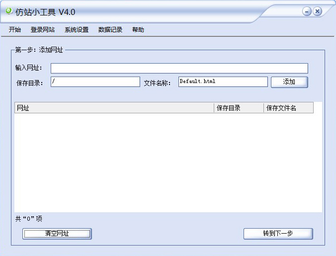

关于软件
========

关于
-----

仿站小工具是一个下载网页的小工具，能够自动检测网页编码，远程下载网页，同时支持同域名和跨域名下载Css文件（导入Css文件）、Js文件、Flash文件，并能够从网页和Css文件中分析出图片和背景图片文件下载到本地，实现不同文件按相对路径或都绝对路径保存到自定义文件夹的小工具。

关键词
-----

仿站小工具 仿站工具 下站工具 网页下载器 页面下载器
